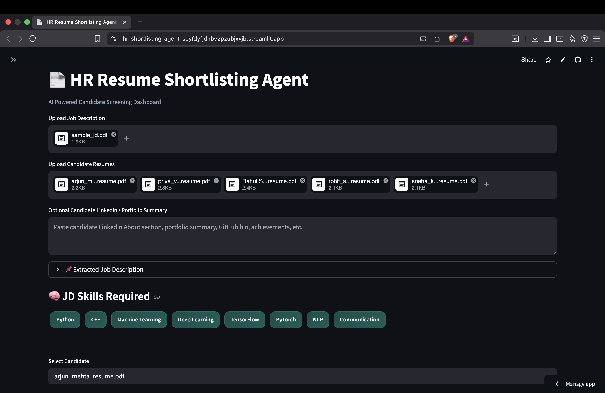
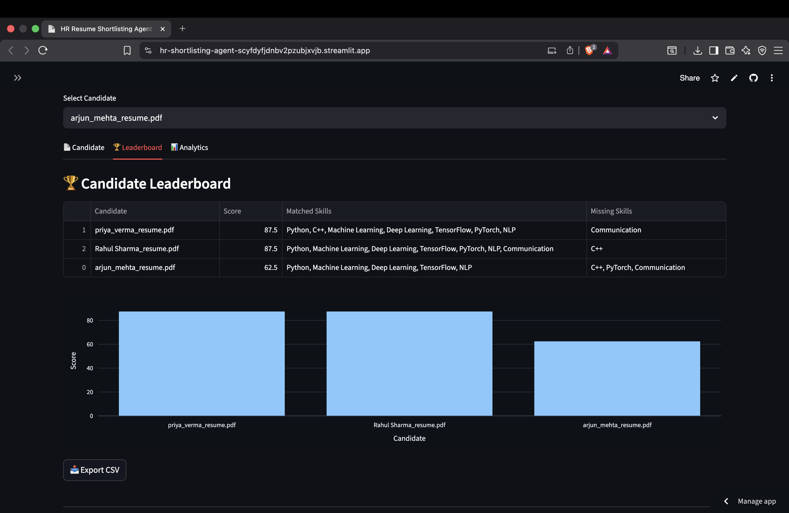
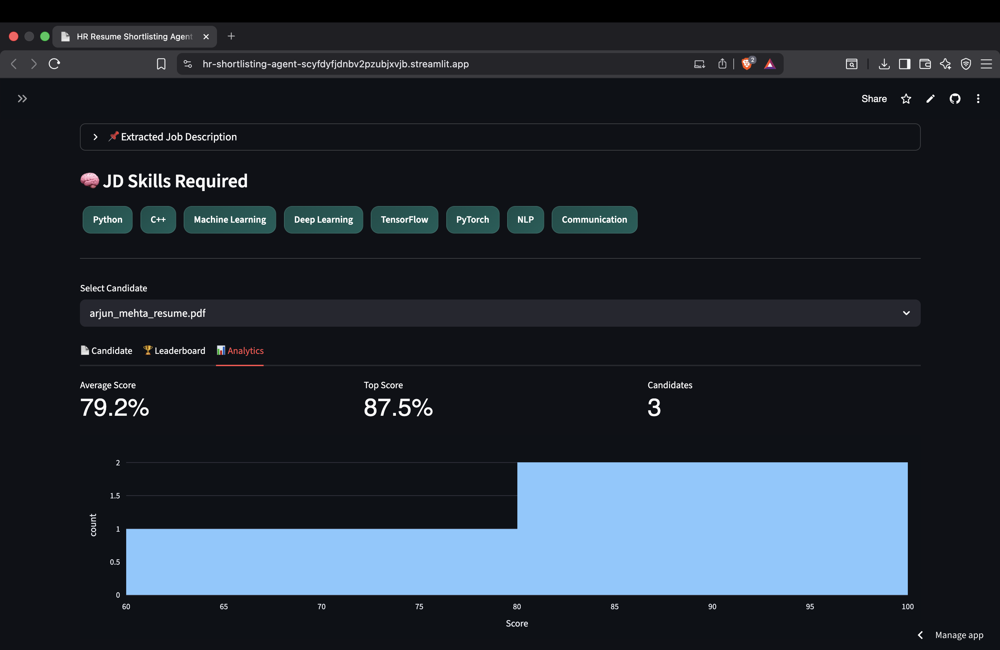
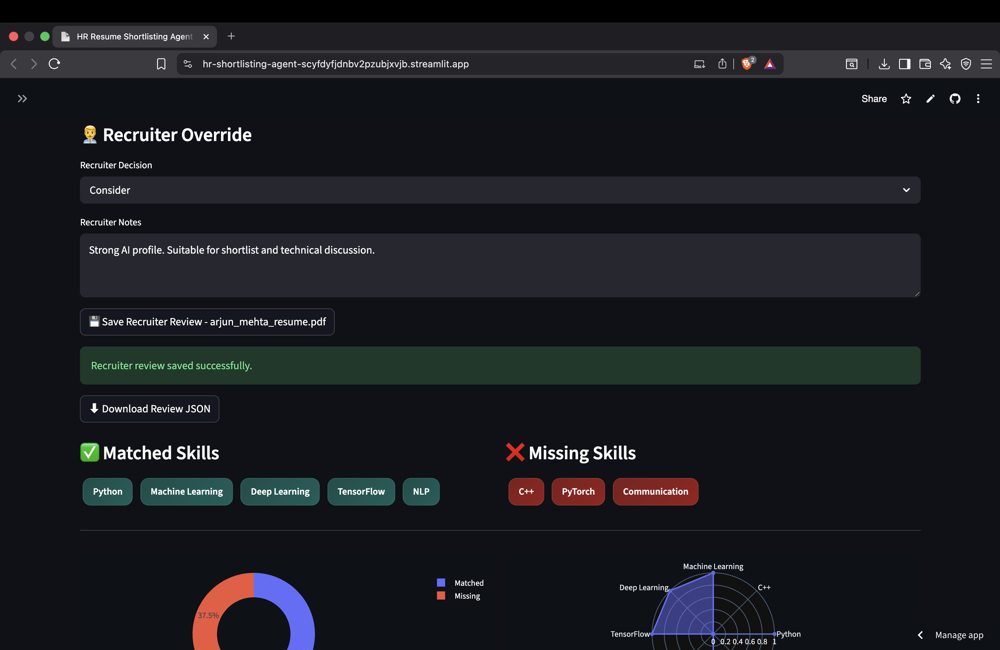
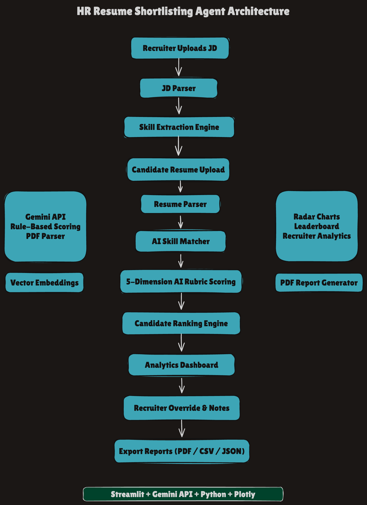

# 🚀 HR Resume Shortlisting Agent

AI-powered recruitment assistant that automates resume screening, candidate ranking, recruiter evaluation, and analytics visualization.

---

# 📌 Features

## ✅ Job Description Parsing

- Extracts skills and requirements from JD PDFs
- Detects technical skills automatically
- AI-assisted job requirement analysis

---

## ✅ Resume Parsing

- Supports multiple resume uploads
- PDF resume extraction
- Candidate skill analysis
- LinkedIn/profile enrichment support

---

## ✅ AI Candidate Evaluation

Uses a 5-dimension evaluation rubric:

| Dimension | Weight |
|---|---|
| Skills Match | 30% |
| Experience Relevance | 25% |
| Education & Certifications | 15% |
| Projects & Portfolio | 20% |
| Communication Quality | 10% |

---
# 📸 Screenshots

## Dashboard


## Leaderboard


## Analytics


## Recruiter Override


## 🎥 Demo Video

[](https://drive.google.com/file/d/1oA8avM172nZvSmIcdunnEOPOtan0t0pc/view?usp=share_link)

# 📊 Dashboard Features

## 👤 Candidate Dashboard

- Match percentage
- Matched skills
- Missing skills
- AI recommendation
- AI justification feedback
- Radar charts
- Pie charts
- Profile bonus scoring

---

## 🏆 Recruiter Analytics

- Candidate leaderboard
- Score distribution
- Recruiter override system
- Recruiter review logging
- Export CSV reports
- Downloadable recruiter reviews
- Candidate comparison analytics

---

# 🧠 AI Features

- Resume semantic evaluation
- Skill matching
- Rule-based scoring engine
- Recruiter override support
- AI recommendation generation
- LinkedIn/profile enrichment scoring
- Justification-based evaluation
- Vector embedding workflow

---

# 🔒 Security Measures

## 🔑 API Key Protection

- API keys stored using `.env`
- No hardcoded credentials

---

## 🛡 Prompt Injection Mitigation

- User inputs sanitized before AI processing
- Structured prompts reduce injection risks

---

## 🧾 Hallucination Reduction

- Scores generated using deterministic rubric system
- Rule-based validation added

---

## 🔐 PII Protection

- Resume data processed temporarily
- No permanent storage of sensitive candidate data

---

## 📁 Secure Recruiter Reviews

- Recruiter logs stored locally as JSON
- No external sharing of candidate information

---

# 🏗️ Architecture

## 🔄 Workflow

1. Upload Job Description
2. Extract JD Skills
3. Upload Candidate Resumes
4. Parse Resume Text
5. Match Candidate Skills
6. Run AI Rubric Evaluation
7. Generate Recruiter Analytics
8. Export Reports

---

# 🏛️ System Architecture



---

# ⚙️ Tech Stack

| Component | Technology |
|---|---|
| Frontend | Streamlit |
| Backend | Python |
| Charts | Plotly |
| AI | Gemini API |
| Data Processing | Pandas |
| PDF Reports | FPDF |
| Embeddings | Vector Similarity |
| Logging | JSON Audit Logs |
| Deployment | Streamlit Cloud |

---

# 📈 Visualizations

- Radar Charts
- Pie Charts
- Leaderboard Analytics
- Score Distribution
- Candidate Ranking

---

# 📂 Project Structure

```bash
hr-shortlisting-agent/

├── app.py
├── .env
├── requirements.txt
├── README.md

├── parsers/
│   ├── pdf_parser.py
│   └── llm_parser.py

├── scoring/
│   ├── matcher.py
│   ├── ai_scorer.py
│   └── rubric_scorer.py

├── recruiter_logs/
├── reports/
├── diagrams/
│   └── architecture.png

├── screenshots/


# 👨‍💻 Author

- Developed as an AI-powered recruitment and resume intelligence platform for internship evaluation and recruiter analytics automation.